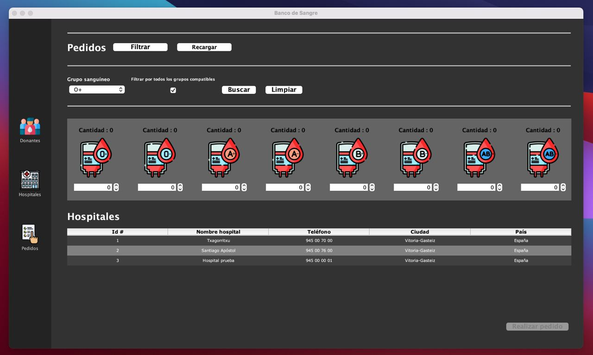
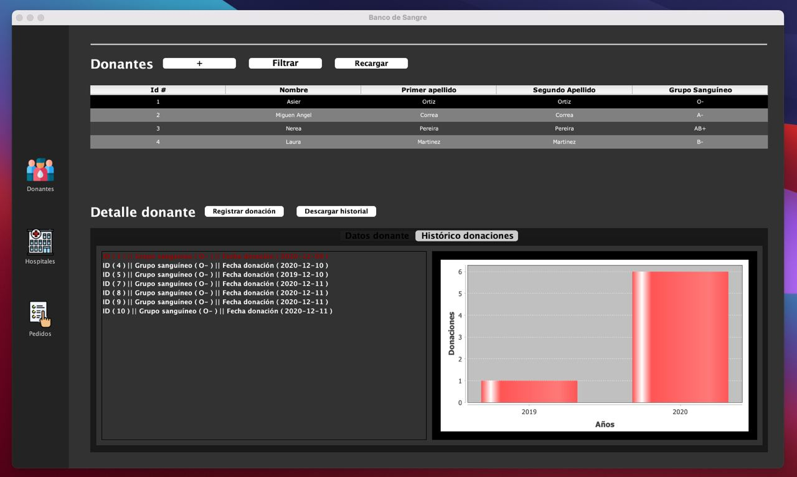
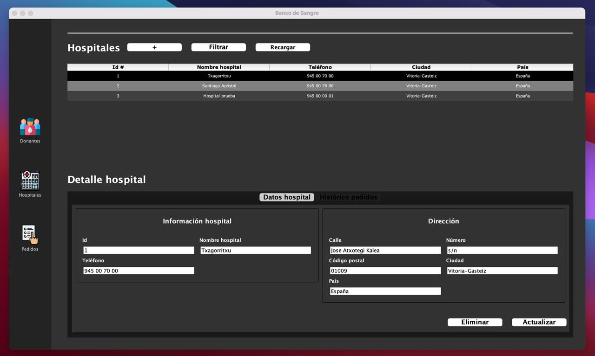

# Blood Bank

The "Blood Bank" project is a Java application designed for managing blood bank operations. It utilizes eXist-db for XML data storage and leverages XPath and XQuery for querying and manipulating this data. The application features a user interface developed with Java Swing, allowing efficient management of donors, blood inventory, and hospital requests. The project focuses on XML database management and provides a comprehensive solution for blood bank administration

## Screenshots

